# Budget Manager

- **Flask** app for budget management.

```bash
# Build the Docker image
docker build -t budget-manager-app:slim .

# Run the Docker container, mapping host port 5000 to container port 5000
docker run -p 5000:5000 budget-manager-app:slim

# Run the Docker container, to be able to edit the code
 docker run -dp 5000:5000 -w /app -v "$(pwd):/app" budget-manager-app:slim
```

## Design

Basic design was generated by [Google Stitch](https://stitch.withgoogle.com/). It is just a rudimentary design, but it is a good starting point.

<details>
<summary>Light Theme</summary>

<table>
  <tr>
    <td>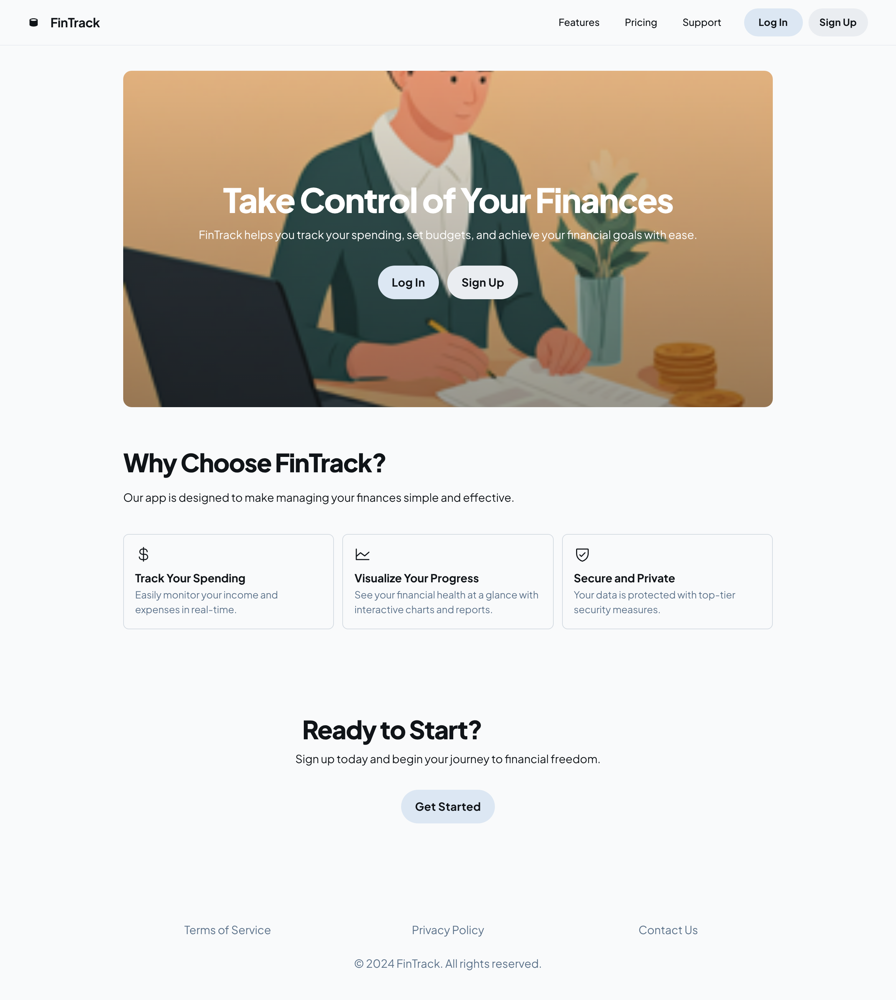</td>
    <td>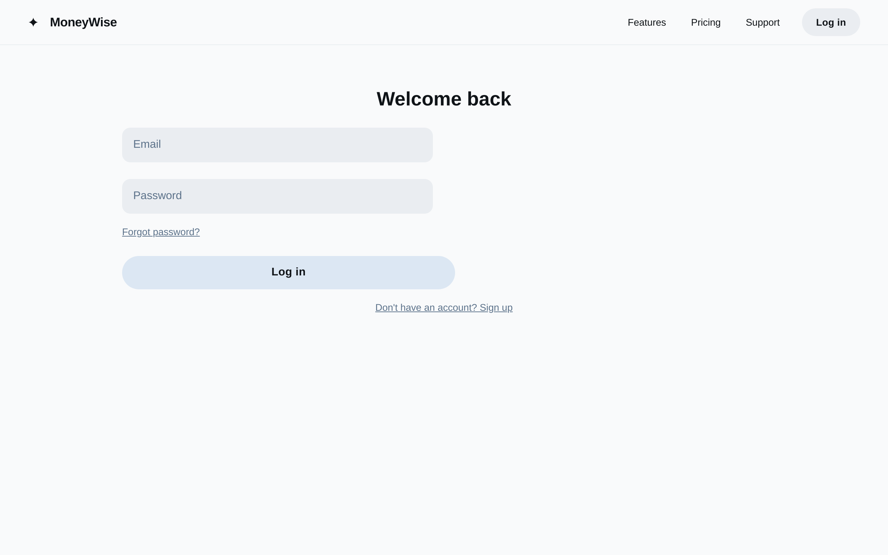</td>
    <td>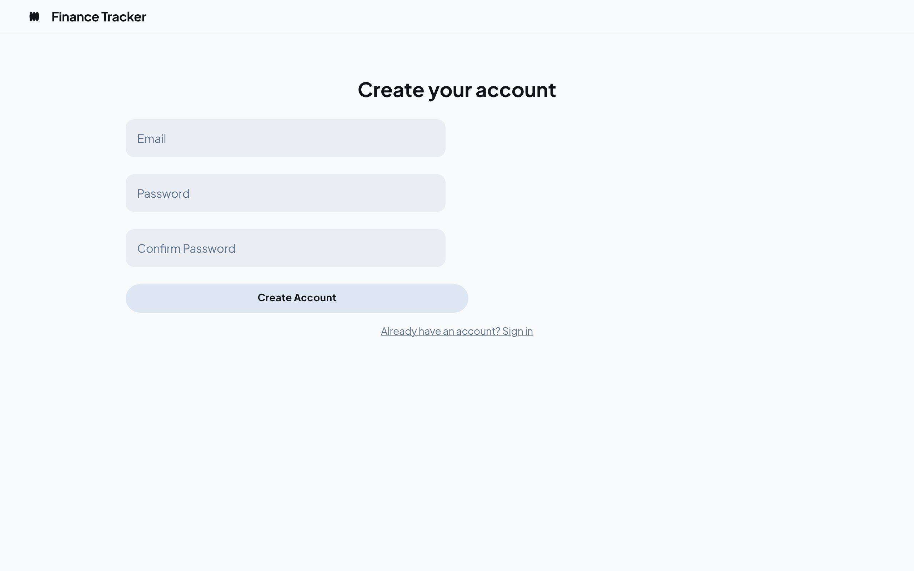</td>
  </tr>
  <tr>
    <td>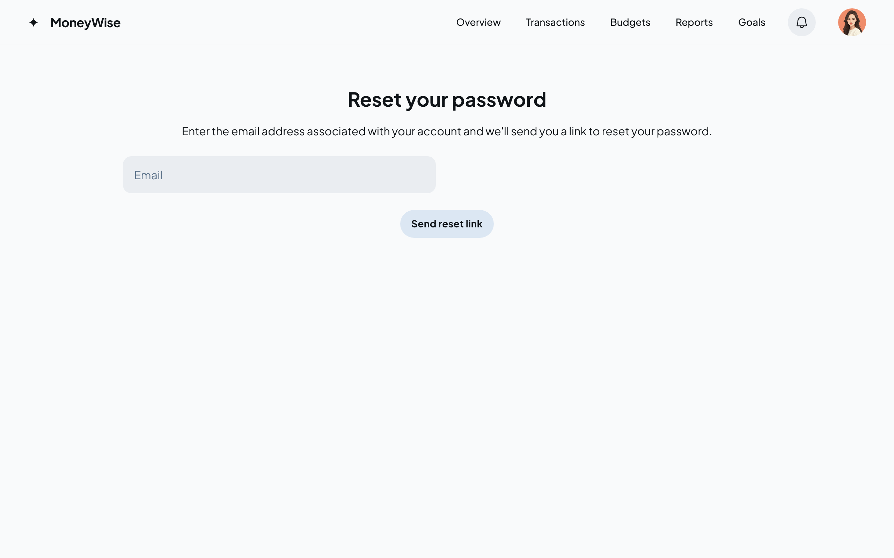</td>
    <td>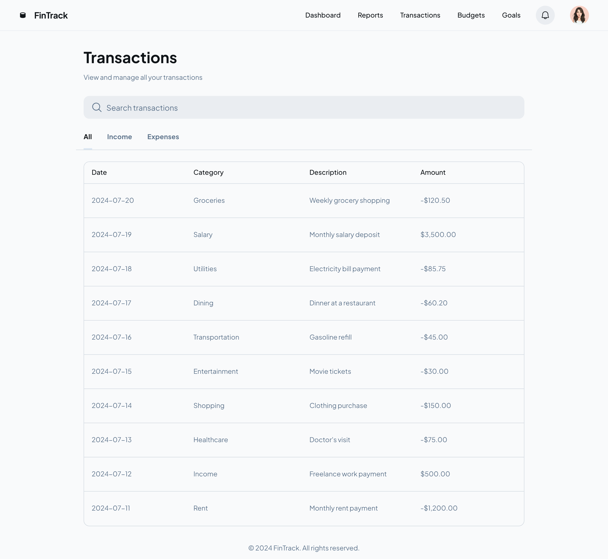</td> 
    <td>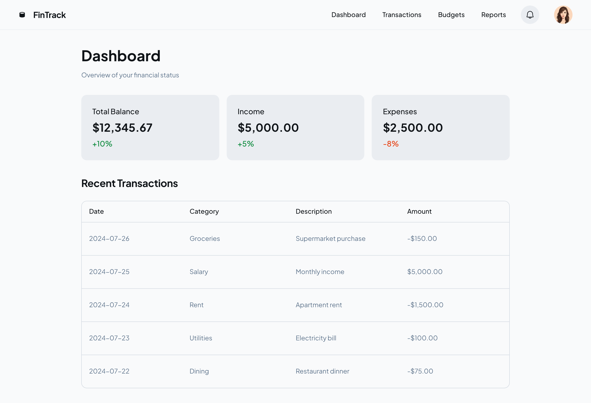</td>
  </tr>
  <tr>
    <td>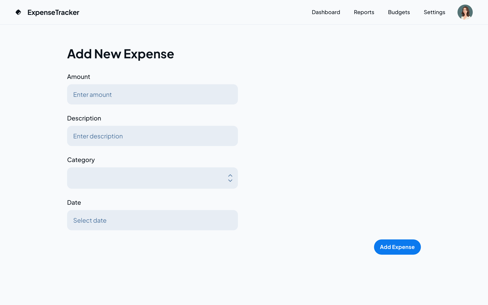</td>
    <td>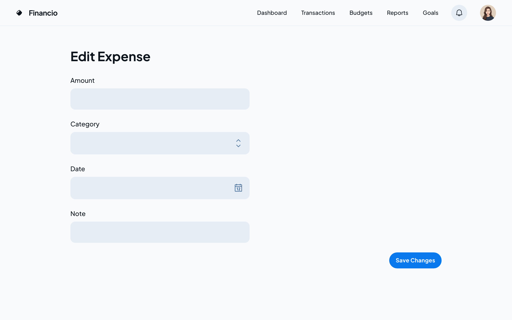</td>
    <!-- <td></td> -->
  </tr>
</table>
</details>

<details>
<summary>Dark Theme</summary>

<table>
  <tr>
    <td></td>
    <td>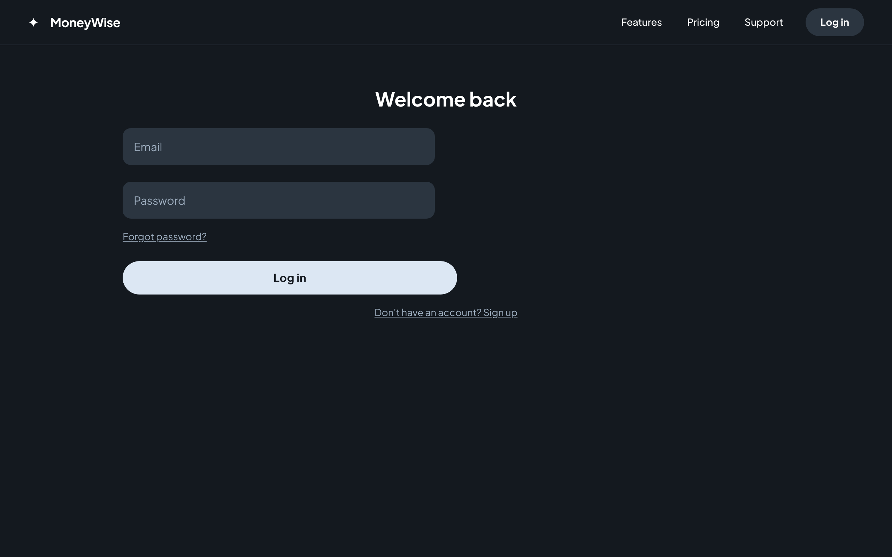</td>
    <td>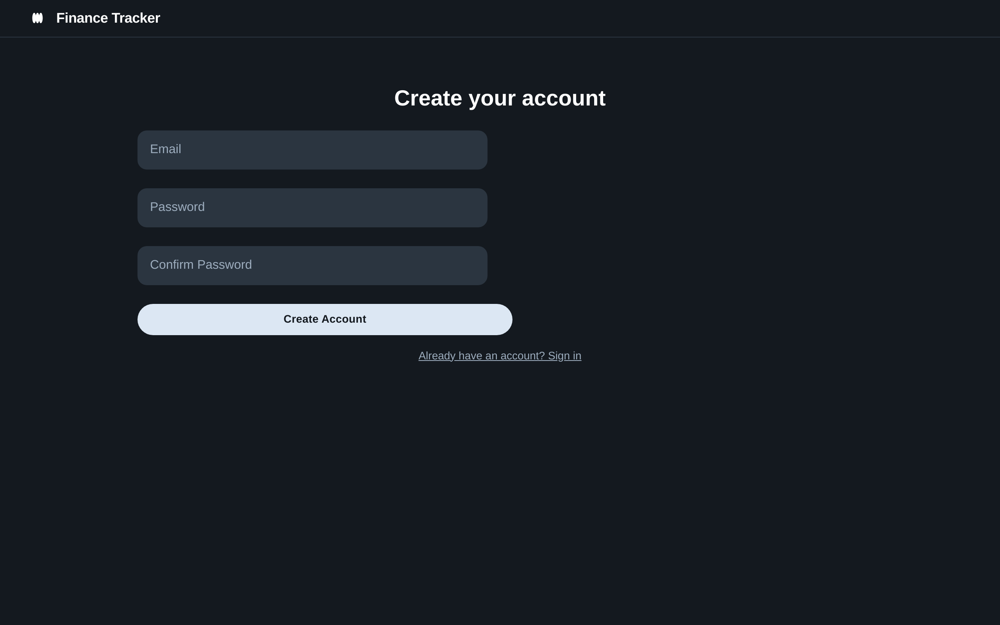</td>
  </tr>
  <tr>
    <td>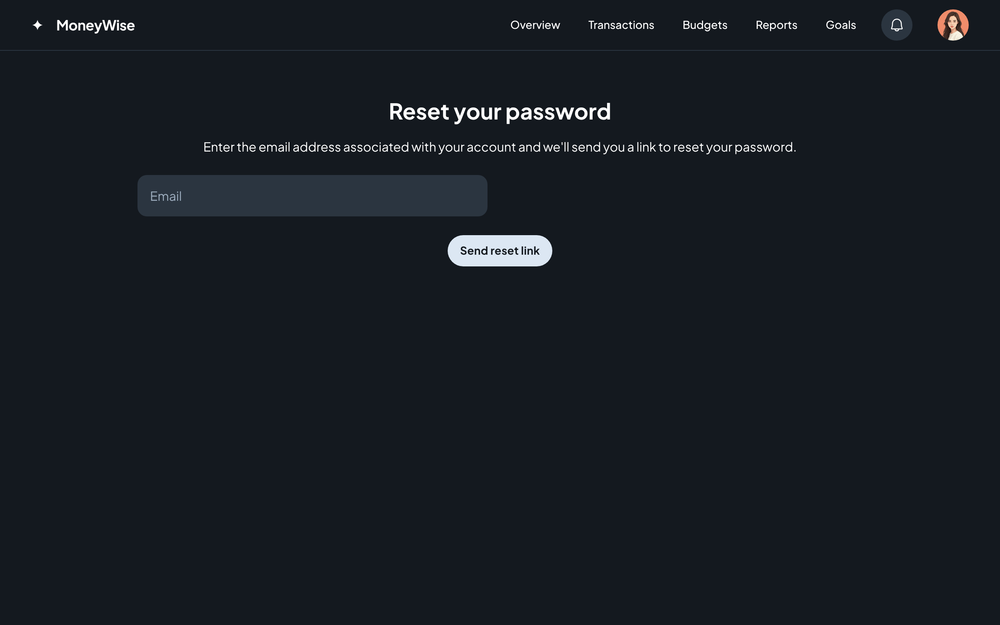</td>
    <td>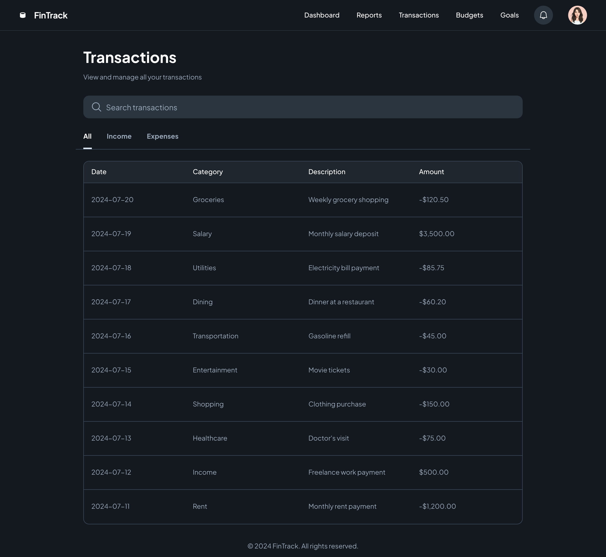</td> 
    <td>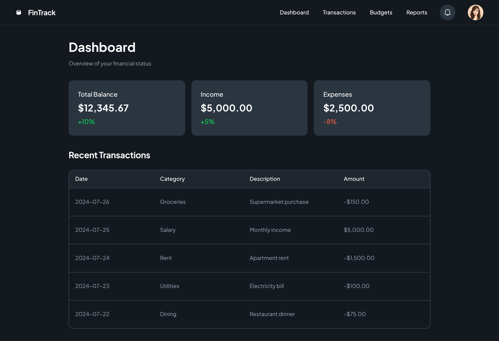</td>
  </tr>
  <tr>
    <td>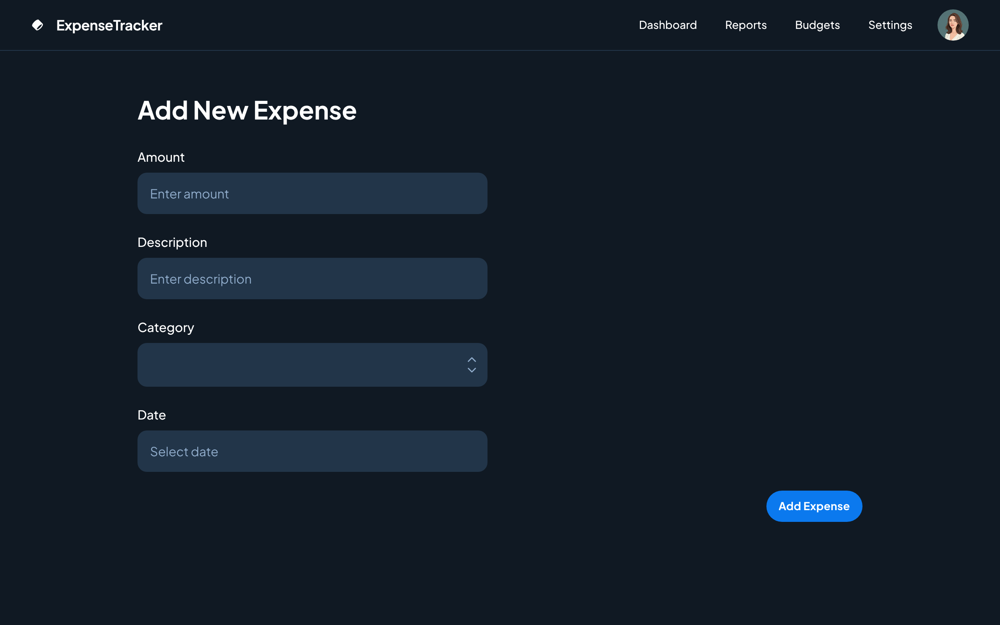</td>
    <td>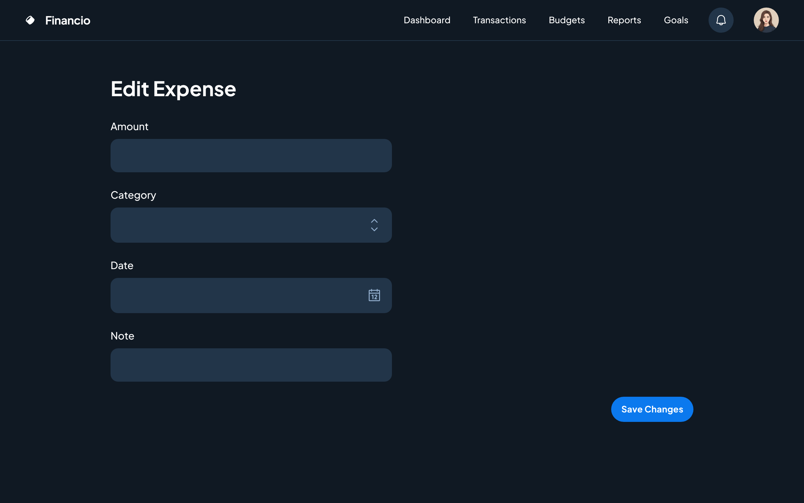</td>
    <!-- <td></td> -->
  </tr>
</table>
</details>

## References

- [How To Create Minimal Docker Images for Python Applications](https://www.kdnuggets.com/how-to-create-minimal-docker-images-for-python-applications)
- [Python Website Full Tutorial - Flask, Authentication, Databases & More](https://youtu.be/dam0GPOAvVI)

- [Rest APIs with Flask and Python](https://rest-apis-flask.teclado.com/docs/flask_smorest/reload_api_docker_container/)

- [How To Build and Deploy a Flask Application Using Docker on Ubuntu 20.04](https://www.digitalocean.com/community/tutorials/how-to-build-and-deploy-a-flask-application-using-docker-on-ubuntu-20-04)

- [How To Build and Deploy a Flask Application Using Docker on Ubuntu 20.04](https://blog.cloudsigma.com/build-and-deploy-a-flask-application-with-docker-on-ubuntu-20-04/)

- [How to Dockerize a Flask App](https://www.freecodecamp.org/news/how-to-dockerize-a-flask-app/)
